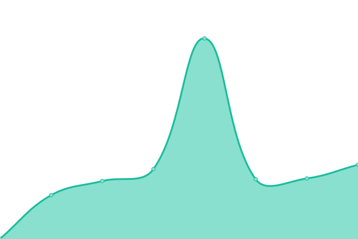

# [📈 Live Status](https://mcmcford.github.io/uptime): <!--live status--> **🟧 Partial outage**

**Quick Overview**

<!--With [Upptime](https://upptime.js.org), you can get your own unlimited and free uptime monitor and status page, powered entirely by a GitHub repository. We use [Issues](https://github.com/upptime/upptime/issues) as incident reports, [Actions](https://github.com/mcmcford/uptime/actions) as uptime monitors, and [Pages](https://upptime.github.io/upptime) for the status page. -->

<!--start: status pages-->
<!-- This summary is generated by Upptime (https://github.com/upptime/upptime) -->
<!-- Do not edit this manually, your changes will be overwritten -->
<!-- prettier-ignore -->
| URL | Status | History | Response Time | Uptime |
| --- | ------ | ------- | ------------- | ------ |
|  [McFord Photography](https://www.mcford.co.uk) | 🟩 Up | [mc-ford-photography.yml](https://github.com/mcmcford/uptime/commits/HEAD/history/mc-ford-photography.yml) | 

 652ms
     
 | 

<a href="https://mcmcford.github.io/uptime/history/mc-ford-photography">97.87%</a>
    

|  Plex Media Server | 🟩 Up | [plex-media-server.yml](https://github.com/mcmcford/uptime/commits/HEAD/history/plex-media-server.yml) | 

 474ms
     
 | 

<a href="https://mcmcford.github.io/uptime/history/plex-media-server">82.64%</a>
    

|  P4 server | 🟥 Down | [p4-server.yml](https://github.com/mcmcford/uptime/commits/HEAD/history/p4-server.yml) | 

 0ms
     
 | 

<a href="https://mcmcford.github.io/uptime/history/p4-server">100.00%</a>
    

|  Torrent Server | 🟩 Up | [torrent-server.yml](https://github.com/mcmcford/uptime/commits/HEAD/history/torrent-server.yml) | 

 414ms
     
 | 

<a href="https://mcmcford.github.io/uptime/history/torrent-server">82.64%</a>
    

|  Twitchy Server | 🟩 Up | [twitchy-server.yml](https://github.com/mcmcford/uptime/commits/HEAD/history/twitchy-server.yml) | 

 264ms
     
 | 

<a href="https://mcmcford.github.io/uptime/history/twitchy-server">100.00%</a>
    

<!--end: status pages-->

[**Visit the status website →**](https://mcmcford.github.io/uptime)

This repository contains the open-source uptime monitor and status page for [Upptime](https://upptime.js.org), powered by [Upptime](https://github.com/upptime/upptime).

## 📄 License 📄

- Powered by: [Upptime](https://github.com/upptime/upptime)
- Code: [MIT](./LICENSE) © [Upptime](https://upptime.js.org)
- Data in the `./history` directory: [Open Database License](https://opendatacommons.org/licenses/odbl/1-0/)
